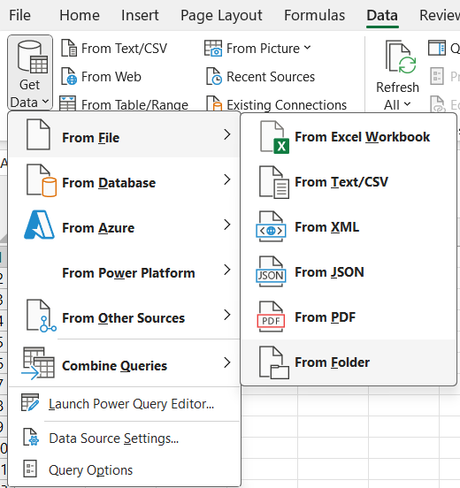
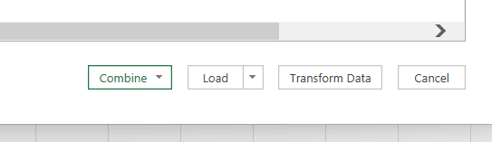
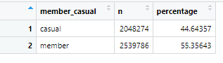
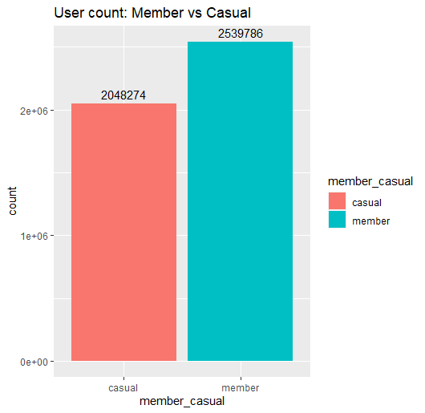
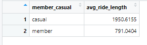
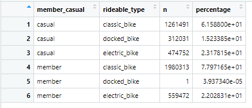
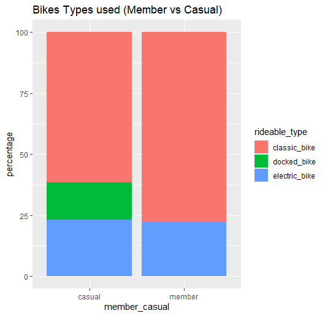

# Cyclistic-Case-Study
Google Data Analytics Capstone: Case Study

## Introduction
In Cyclistic bike-share, while working with a junior data analyst, we need to understand how the company works. 
It's very important to understand the process in analysis: ask, prepare, process, analyze, share, and act. 
After running through all these processes, we can understand the marketing analyst team at Cyclistic, a bike-share company in Chicago

### Scenario and Company
Working with the marketing analyst team at Cyclistic, the director of marketing believes the company needs to maximize the number of annual memberships. 
We need to understand how casual riders and annual members use Cyclistic bikes differently. The company started in 2016 and launched a successful bike-share offering. 
The objective in this analysis is to convert casual riders into members.

## Ask
### Questions
In this process we have 3 questions that guide this marketing program:
1. How do annual members and casual riders use Cyclistic bikes differentyly?
2. Why would casual riders buy Cyclistic annual memberships?
3. How can Cyclistic use digital media to influence casual riders to become members?


## Prepare
After answering the questions, we run this process to prepare our data.
The dataset is located on an AWS file server where the zip files are, and we need to download and store them locally on the desktop.
In this phase, we need to understand our data and see if it is secure.

After that we need understand the credibility and integrity of the data - ROCCC
* Reliablity
* Originality
* Comprehensiveness
* Current
* Cited

## Process
### Data Cleaning
The format our data is CSV. All the table we have same set of column names:
* ride_id;
* rideable_type;
* started_at;
* ended_at;
* start_station_name;
* start_station_id;
* end_station_name;
* end_station_id;
* start_lat;
* start_lng;
* end_lat;
* end_lng;
* member_casual;

#### Excel
For formating our data we can use Power Query and this tool can automatic process to combine files in a single, but we can use programmer languagues to create one fast process.
For using this we can go in this:




* Wait: Use this method is not recommend because we had a lot rows and maximum number of rows in Power Query is limitation in 1,048,576.
* To use this tool we need divide in multiples files and because this is most recommend use programmer. And in this case we use R or SQL.

#### R
Similar in Power Query, we can solve our problem in fast way. Import our CSV and renamed.
After rename, we can wrangle data and combine into a single file.

The first think to do is install packages.
```
install.packages("tidyverse")
library(tidyverse)
```

Now its important open our path and read our file. To do this use this command:

```
setwd('C:/YOUR_PATH')
jan21 <- read_csv('202101-divvy-tripdata.csv')
```

To exam our process, we use this command:

```
colnames(jan21)
```

To compare our dataset file we use this command:

```
compare_df_cols(jan21, fev21, mar21, apr21, may21, jun21, jul21, aug21, sep21, oct21, nov21, dec21)
```

After we see than our data is uniform we can combined our data in single dataset file:
  
```
divvy_tripdata_raw<- rbind(jan21, feb21, mar21, apr21, may21, jun21, jul21, aug21, sep21, oct21, nov21, dec21)
```

For see the head of the combined dataset, we use this command:

```
head(divvy_tripdata_raw)
```

And least command is this process, we can see examined our data using this comamand:

```
dim(divvy_tripdata_raw)
```

In the clean process data for analysis to prepare we need transform our data using this code:
```
divvy_tripdata_raw$started_at = strptime(divvy_tripdata_raw$started_at, "%Y-%m-%d %H:%M:%S")
divvy_tripdata_raw$ended_at = strptime(divvy_tripdata_raw$ended_at, "%Y-%m-%d %H:%M:%S")

str(divvy_tripdata_raw)

divvy_tripdata_raw$date <- as.Date(divvy_tripdata_raw$started_at)
divvy_tripdata_raw$month <- format(as.Date(divvy_tripdata_raw$date), "%m")
divvy_tripdata_raw$day <- format(as.Date(divvy_tripdata_raw$date), "%d")
divvy_tripdata_raw$year <- format(as.Date(divvy_tripdata_raw$date), "%Y")
divvy_tripdata_raw$day_of_week <- format(as.Date(divvy_tripdata_raw$date), "%A")
divvy_tripdata_raw$ride_length <- difftime(divvy_tripdata_raw$ended_at, divvy_tripdata_raw$started_at)

str(divvy_tripdata_raw)
```

To removed unneecssary data we this commands:

```

unique(divvy_tripdata_raw$member_casual)

unique(divvy_tripdata_raw$rideable_type)

sum(duplicated(divvy_tripdata_raw$ride_id))

divvy_tripdata21<-divvy_tripdata_raw%>%
  filter(ride_length>0)

divvy_tripdata_withstation <- divvy_tripdata21 %>%
  drop_na()

nrow(divvy_tripdata_withstation)

summary(divvy_tripdata_withstation)
```


* Finalized our data cleaning process we can export the csv file to realized analysis in Tableau.
```
write.csv(divvy_tripdata_withstation, "trips 2021.csv")
```


## Analyze
### R
To start our analyze we use summerize command. To show numbers member_casual, this commmand is used:
```
executive_summ <- divvy_tripdata_withstation %>%
group_by(member_casual) %>%
summarize(n=n())%>%
mutate(percentage = n*100/sum(n))

view(executive_summ)

ggplot(data = divvy_tripdata_withstation, aes(x = member_casual, fill = member_casual)) +
  geom_bar() +
  geom_text(stat = "count", aes(label = ..count..), vjust = -0.5) +
  labs(title = "User count: Member vs Casual")
```

In this situation, we can see this:






* To analyze the average in 2021 we use this code:
```
divvy_tripdata_withstation$ride_length <- as.numeric(divvy_tripdata_withstation$ride_length)

executive_summ_2 <- divvy_tripdata_withstation %>%
  group_by(member_casual) %>%
  summarize(avg_ride_length = mean(ride_length))

view(executive_summ_2)
```



* And to understand the rideable_type we use this command:
```
executive_summ_3 <- divvy_tripdata_withstation %>%
  group_by(member_casual, rideable_type) %>%
  summarize(n=n())%>%
  mutate(percentage = n*100/sum(n))

view(executive_summ_3)

ggplot(data = executive_summ_3, aes(x = member_casual, y=percentage, fill = rideable_type)) +
  geom_col() +
  labs(title = "Bikes Types used (Member vs Casual)")
```





